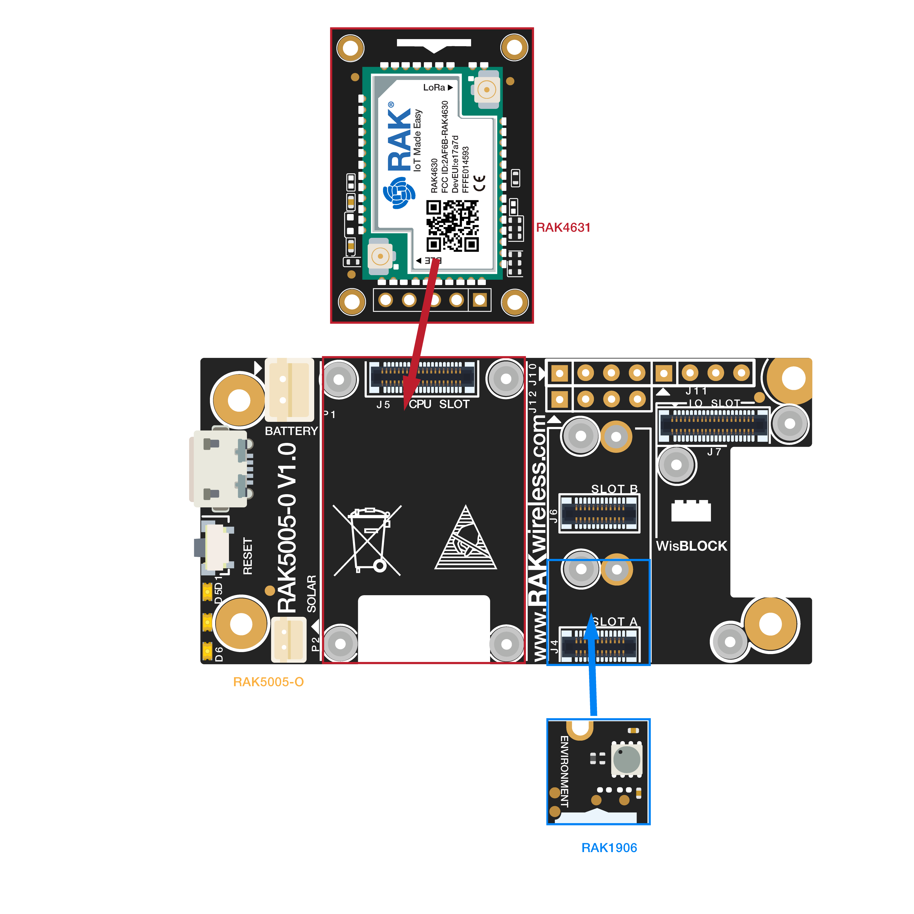

# WisBlock Weatherstation using WisBlock Sensor RAK1960 (BME680)

This example shows how to use the WisBlock Sensor RAK1906 environment board. It uses OTAA to connect to the network and CayenneLPP to encode the payload.

The WisBlock Sensor RAK1906 environment board uses gas sensor BME680  which can measure relative humidity, barometric pressure, ambient temperature and gas (VOC).

Product physical map is as follows:

----
## Hardware required
----
To use the WisBlock Sensor RAK1906 environment board, The following hardware is required.

- WisBlock Base RAK5005-O  \*  1pcs
- WisBlock Core RAK4631    \*  1pcs
- WisBlock Sensor RAK1906  \*  1pcs

Hardware is shown as follows:

For stable connection, please use screws to tighten.

----
## Getting started
----

1. Install PlatformIO if you have not yet so (https://www.platformio.org)
1. Install support for WisBlock to PLatformIO (https://github.com/RAKWireless/WisBlock/tree/master/PlatformIO)
1. You might want to update your WisBlock Core to the latest bootloader (check )
1. Copy the `keys.h.sample` file into `keys.h`, edit it and configure the credentials for your devices.
1. Open the `main.ino` file, find the `Configuration` section and tweak it to your needs.
1. From the `code` folder (same where the `platformio.ini` file is) run `pio run` to build the image
1. Connect your device and run `pio run -t upload` to upload the code to your device
1. If debug is enabled you will see output on the serial port (use `pio device monitor` to check it)
